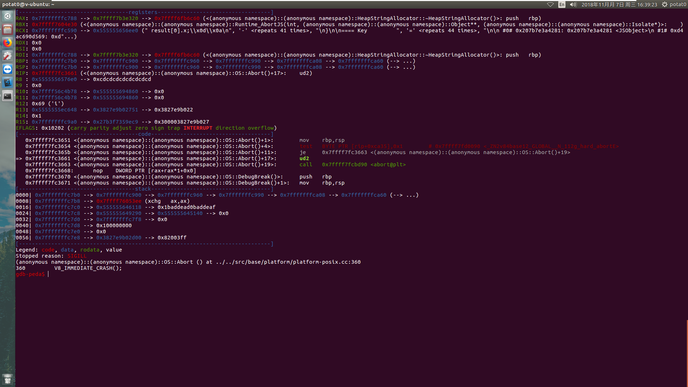
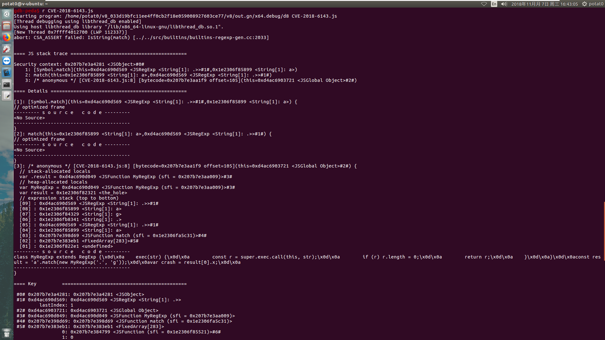
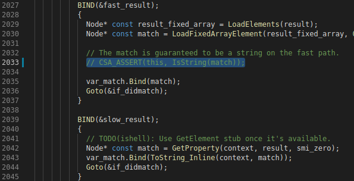
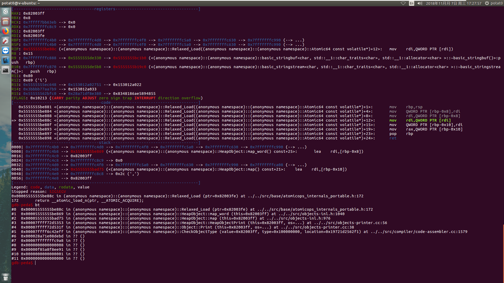

# Ubuntu 16.04 x64搭建V8调试环境

**Author:wnagzihxa1n
E-Mail:wnagzihxa1n@gmail.com**

上一篇文章分享了如何在Linux上面搭建V8源码编译环境以及如何编译V8源码，在我后续的使用过程中，逐渐发现了若干问题，不是编译的问题，而是对于不同版本之间切换编译，Poc验证等，我会在这篇文章中分享一下这些问题的解决方法

回顾一下上一次的编译，我们在下载完源码后进行了编译，那么这个编译过程就会下载很多编译工具，以及产生很多编译过程中的文件，比如`.o`文件，如果我们在此时进行版本切换，git对于这些文件肯定会产生报错，所以这个时候我们需要使用git分支管理的形式

具体细节我就不描述了，毕竟我不是很喜欢分支切换这种操作

嗯，用的是很直观的文件夹管理，首先fetch回源码后，啥都不做，checkout到所需要的commit，然后拷贝一份，后缀命名为commit ID，如下
```
drwxrwxr-x  3 potat0 potat0  4096 11月  5 19:18 V8
drwxrwxr-x  4 potat0 potat0  4096 11月  6 12:43 v8_033d19bfc11ee4ff0cb2f18e059008927603ce77
```

那么`V8`这个文件夹我就是用来当做checkout用的，进入我们拷贝的文件夹进行编译操作即可

是有点挫，但是好用啊！

编译完成后，我们现在来配置一下gdb调试环境，正常情况下我们取消掉git代理
```
potat0@v-ubuntu:~$ git config --global --unset http.proxy
potat0@v-ubuntu:~$ git config --global --unset https.proxy
```

安装pwntools等工具
```
potat0@v-ubuntu:~$ sudo pip install pwntools
potat0@v-ubuntu:~$ sudo pip install pwn
potat0@v-ubuntu:~$ sudo pip install zio
```

给gdb安装peda插件
```
potat0@v-ubuntu:~$ git clone https://github.com/longld/peda.git ~/peda
potat0@v-ubuntu:~$ echo "source ~/peda/peda.py" >> ~/.gdbinit
```

来运行一个Poc
```
class MyRegExp extends RegExp {
    exec(str) {
        const r = super.exec.call(this, str);
        if (r) r.length = 0;
        return r;
    }
}
const result = 'a'.match(new MyRegExp('.', 'g'));
var crash = result[0].x;
```

断在如下位置，看起来好像是击中了`DCHECK`之类的



往前翻，可以看到确实是击中了`CSA_ASSERT`，一开始我想着把击中的`CSA_ASSERT`注释掉就好，sakura师傅教我把`CSA_ASSERT`的宏注释掉，简直是醍醐灌顶



但是我依旧要注释掉当前这一句
```
abort: CSA_ASSERT failed: IsString(match) [../../src/builtins/builtins-regexp-gen.cc:2033]
```



重新编译，需要修改58个文件
```
potat0@v-ubuntu:~/v8_033d19bfc11ee4ff0cb2f18e059008927603ce77/v8$ ninja -C out.gn/x64.debug
ninja: Entering directory `out.gn/x64.debug'
[58/58] STAMP obj/gn_all.stamp
```

sakura师傅说调试V8碰到被断言击中的概率很低，然而我这一个洞就击中了两次，捂脸.jpg(逃~~~)

然后再次跑起来就可以了，下面我查看了一下函数回溯栈



由于我们这里并不是为了分析漏洞，所以就到这里

